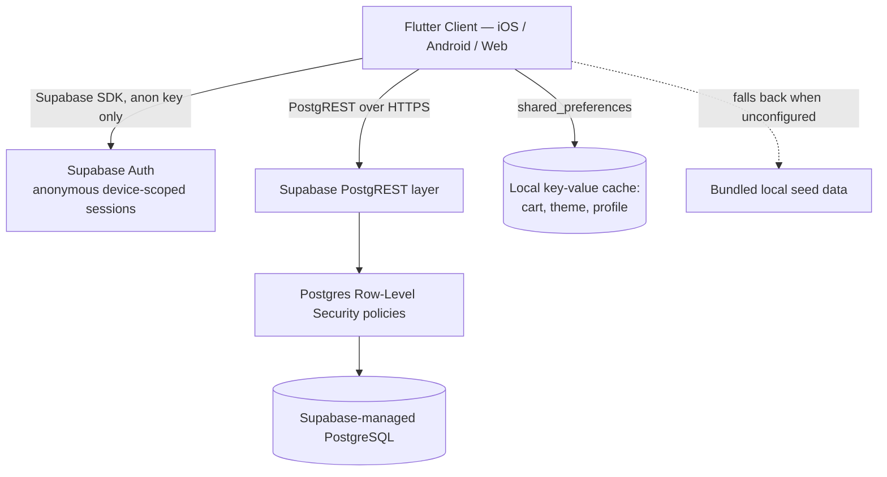
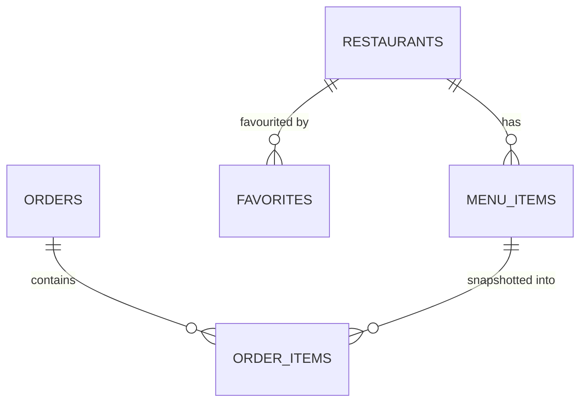

# System Design Document (SDD): ZimDash

- **Purpose:** Component diagrams, database schemas, and infrastructure layouts.
- **Phase:** 3 — Solution Architecture.
- **Owner:** Lead Architect.
- **Approver:** Principal Architect / Lead Engineer.

## 1. Architectural Component Diagram

This differs from the handbook's default topology (Nginx/Coolify reverse proxy → self-hosted FastAPI
→ self-hosted Postgres + Redis) in one structural way: **there is no application server ZimDash
operates.** Supabase supplies auth, the REST layer, and Postgres as a managed unit; the "backend" the
team controls is entirely declarative — RLS policies and schema migrations — not a codebase serving
HTTP requests. This should be revisited once Phase 1 introduces payment verification and order
dispatch, both of which likely need server-side logic Supabase's client-facing REST layer cannot
safely hold (see ADR-002 and the Threat Model).

## 2. Deployment Topology

- **Host target:** Supabase managed cloud project (no self-hosted VPS node for the current prototype).
- **Client distribution:** iOS App Store, Google Play, and a web build — no containerized deployment
  pipeline exists yet for any of the three.
- **Environment separation:** not yet defined. No documented staging vs. production Supabase project
  split — open item for Phase 1 (see Risk Register).

## 3. Data Persistence Layer

Six tables today, split between shared reference data and per-user data:

| Table | Visibility | Purpose |
|---|---|---|
| `restaurants` | Public, read-only | Name, cuisine, rating, delivery time/fee, tags, brand colour. Currently edited by hand, not by vendors. |
| `menu_items` | Public, read-only | Belongs to a restaurant; name, description, price, category, popular flag. |
| `promo_codes` | Public, read-only | Percent or flat discount, minimum subtotal. |
| `orders` | Owned by placing user (RLS) | Customer/delivery details, payment method, full fee breakdown, total. |
| `order_items` | Scoped via parent `orders` | Line items, snapshotted at purchase time. |
| `favorites` | Owned by user (RLS) | User–restaurant join. |

## 4. Network Boundaries

- **Trust boundary:** the client ships only the Supabase anon key. All write access to `orders`,
  `order_items`, and `favorites` is gated by RLS policies keyed to the authenticated (including
  anonymous) user id — there is no separate authorization layer in application code because there is
  no application server.
- **No service-role key** is present client-side; any future operation that requires it (e.g. admin
  vendor approval) must run behind a boundary the client cannot reach directly — this is a concrete
  architectural requirement for the Admin/ops console in Phase 2, not a nice-to-have.

## 5. Observability Schema

None exists today — appropriate for a client-only prototype with a managed backend, but a real gap
once Phase 1 introduces:
1. A payment-verification path (webhook or server callback) — this needs its own logging/tracing
   surface since a failed or double-processed payment is a direct financial risk.
2. An order-dispatch state machine — needs structured state-transition logging to debug "an order got
   stuck" reports, which the current client-side timer simulation cannot produce because it isn't
   real.

Recommendation: whatever server-side component is introduced for payments/dispatch in Phase 1 should
follow this handbook's Phase 5 telemetry standard (structured JSON logs, `/health` and `/health/ready`
endpoints) even though it doesn't apply to the Supabase-managed layer itself.

## 6. Known Architectural Gap: Local Persistence vs. Offline-First

`shared_preferences` is a key-value cache used for fast startup and basic offline resilience, not a
relational offline-first store. Per the mobile-engineering offline-first standard in this guide
library, a reactive SQLite layer (e.g. Drift) would be the production pattern if ZimDash's target
network conditions (constrained mobile data, per the SRS) turn out to require true offline order
composition rather than just cached reads. Not a Phase 0/1 blocker — flagged here so it's a deliberate
future decision, not a surprise.

---
*Traceability: child of `../requirements/srs.md`; decisions recorded here are elaborated in `adr/`.*
